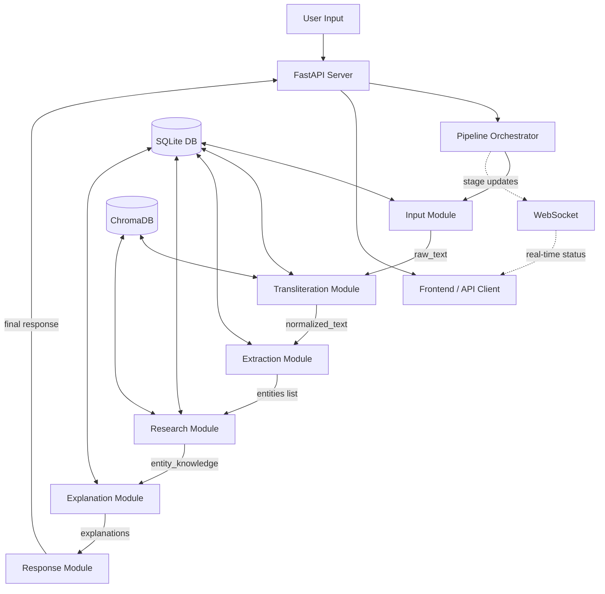

# Tamil Entity Recognition & Explanation System — Implementation Plan

## Overview

Build a full-architecture prototype that accepts Tamil content in **any form** (text, image, PDF, audio, video, URL), identifies all named entities, researches each entity from multiple sources, and generates detailed bilingual (Tamil + English) explanations with confidence scores and source attribution.

> [!IMPORTANT]
> **Prototype-grade, full-architecture.** Every layer from the architecture doc is implemented. No security/gateway layer. SQLite + ChromaDB instead of PostgreSQL/Redis. Every API/processor is **configurable and toggleable** — disabling one never breaks the pipeline.

---

## Technology Stack

| Layer | Technology | Why |
|-------|-----------|-----|
| Backend Server | **FastAPI** (Python 3.11+) | Async-native, WebSocket support, auto docs |
| Database | **SQLite** (via `aiosqlite`) | Zero-setup, file-based, sufficient for prototype |
| Vector DB | **ChromaDB** | Embedding storage, similarity search, runs embedded |
| LLM APIs | **Gemini / GPT-4 / Claude / Ollama** (configurable) | Explanation generation, fallback NER |
| NER Models | **spaCy / Stanza / Cloud NER / LLM** (all toggleable) | Multi-model ensemble extraction |
| OCR | **EasyOCR / Google Vision / Tesseract** (toggleable) | Tamil + English image text extraction |
| ASR | **Whisper / Google Speech / Azure Speech** (toggleable) | Tamil audio transcription |
| Frontend | **React 18** + Vite | Modern SPA, real-time updates via WebSocket |
| Testing | **pytest** + `pytest-asyncio` | Async test support |

---

## Project Directory Structure

```
tamil-entity-system/
├── backend/
│   ├── config/
│   │   ├── __init__.py
│   │   ├── settings.py              # Central config loader (Settings class)
│   │   ├── default_config.yaml      # Default configuration file
│   │   └── test_config.yaml         # Minimal config for testing (free APIs only)
│   │
│   ├── core/
│   │   ├── __init__.py
│   │   ├── database.py              # SQLite + ChromaDB setup
│   │   ├── models.py                # SQLite table definitions (all schemas)
│   │   ├── state.py                 # SystemState TypedDict
│   │   ├── contracts.py             # SourceResult, SourceConfig, etc.
│   │   ├── base_agent.py            # BaseAgent class
│   │   ├── base_source.py           # BaseSourcePlugin ABC
│   │   ├── base_processor.py        # BaseInputProcessor ABC
│   │   ├── llm_client.py            # LLM provider wrapper (Gemini/GPT/Claude/Ollama)
│   │   └── logger.py                # Logging setup
│   │
│   ├── modules/
│   │   ├── input/
│   │   │   ├── __init__.py
│   │   │   ├── coordinator.py       # InputProcessingAgent
│   │   │   ├── text_processor.py
│   │   │   ├── image_processor.py   # OCR engines (EasyOCR, Google Vision, Tesseract)
│   │   │   ├── pdf_processor.py
│   │   │   ├── audio_processor.py   # ASR engines (Whisper, Google, Azure)
│   │   │   ├── video_processor.py
│   │   │   └── url_processor.py
│   │   │
│   │   ├── transliteration/
│   │   │   ├── __init__.py
│   │   │   ├── agent.py             # TransliterationAgent
│   │   │   ├── script_detector.py
│   │   │   ├── transliterators.py   # Google Translate, Indic, AI4Bharat APIs
│   │   │   └── consensus.py         # Multi-API consensus logic
│   │   │
│   │   ├── extraction/
│   │   │   ├── __init__.py
│   │   │   ├── agent.py             # EntityExtractionAgent
│   │   │   ├── spacy_extractor.py
│   │   │   ├── stanza_extractor.py
│   │   │   ├── cloud_extractor.py   # Google NLP, Azure
│   │   │   ├── llm_extractor.py     # LLM-based fallback
│   │   │   ├── merger.py            # Entity overlap merging & voting
│   │   │   └── normalizer.py        # Entity type normalization
│   │   │
│   │   ├── research/
│   │   │   ├── __init__.py
│   │   │   ├── agent.py             # EntityResearchAgent
│   │   │   ├── sources/
│   │   │   │   ├── __init__.py
│   │   │   │   ├── wikipedia.py     # Tamil + English Wikipedia
│   │   │   │   ├── wikidata.py      # SPARQL queries
│   │   │   │   ├── dbpedia.py
│   │   │   │   ├── google_kg.py     # Google Knowledge Graph
│   │   │   │   ├── web_search.py    # Google/DuckDuckGo/Bing
│   │   │   │   ├── news.py          # NewsAPI, GNews
│   │   │   │   ├── youtube.py       # Transcript search
│   │   │   │   ├── tamil_sources.py # Tamil Virtual Academy, etc.
│   │   │   │   ├── government.py    # TN/India gov portals
│   │   │   │   ├── academic.py      # Google Scholar
│   │   │   │   └── llm_source.py    # LLM as knowledge source
│   │   │   ├── synthesizer.py       # Fact aggregation & conflict resolution
│   │   │   └── plugin_manager.py    # Custom source plugin manager
│   │   │
│   │   ├── explanation/
│   │   │   ├── __init__.py
│   │   │   ├── agent.py             # ExplanationAgent
│   │   │   ├── tamil_generator.py
│   │   │   ├── english_generator.py
│   │   │   ├── hallucination_checker.py
│   │   │   └── quality_validator.py
│   │   │
│   │   └── response/
│   │       ├── __init__.py
│   │       ├── builder.py           # ResponseBuilderAgent
│   │       ├── json_formatter.py
│   │       ├── html_formatter.py
│   │       ├── markdown_formatter.py # Markdown export
│   │       └── pdf_formatter.py
│   │
│   ├── pipeline/
│   │   ├── __init__.py
│   │   └── orchestrator.py          # Full pipeline: input → ... → response
│   │
│   ├── server/
│   │   ├── __init__.py
│   │   ├── app.py                   # FastAPI app creation
│   │   ├── routes/
│   │   │   ├── __init__.py
│   │   │   ├── process.py           # /api/process — main processing endpoint
│   │   │   ├── entities.py          # /api/entities — CRUD for entity knowledge
│   │   │   ├── config.py            # /api/config — configuration management
│   │   │   ├── sources.py           # /api/sources — source management
│   │   │   ├── feedback.py          # /api/feedback — user feedback
│   │   │   ├── db_admin.py          # /api/db — DB browse/manage
│   │   │   └── health.py            # /api/health — system health
│   │   ├── websocket.py             # WebSocket for real-time processing status
│   │   └── middleware.py            # CORS, error handling
│   │
│   ├── tests/
│   │   ├── conftest.py              # Shared fixtures (test DB, test config, test app)
│   │   ├── test_data.py             # Sample Tamil texts and expected results
│   │   ├── unit/
│   │   │   ├── test_core/
│   │   │   ├── test_input/
│   │   │   ├── test_transliteration/
│   │   │   ├── test_extraction/
│   │   │   ├── test_research/
│   │   │   ├── test_explanation/
│   │   │   └── test_response/
│   │   ├── module/
│   │   │   ├── test_core_module.py
│   │   │   ├── test_input_module.py
│   │   │   ├── test_transliteration_module.py
│   │   │   ├── test_extraction_module.py
│   │   │   ├── test_research_module.py
│   │   │   ├── test_explanation_module.py
│   │   │   ├── test_response_module.py
│   │   │   └── test_server_module.py
│   │   ├── integration/
│   │   │   ├── test_full_pipeline.py
│   │   │   ├── test_api_endpoints.py
│   │   │   ├── test_config_toggles.py
│   │   │   ├── test_contracts.py
│   │   │   └── test_caching.py
│   │   └── fixtures/
│   │       ├── tamil_text_image.png  # Sample Tamil image for OCR tests
│   │       ├── sample.pdf            # PDF with Tamil content
│   │       └── sample_audio.wav      # Short Tamil speech clip
│   │
│   ├── requirements.txt
│   └── main.py                      # Entry point
│
├── frontend/
│   ├── src/
│   │   ├── components/
│   │   ├── pages/
│   │   ├── services/                # API client services
│   │   ├── hooks/
│   │   ├── stores/
│   │   ├── App.jsx
│   │   └── main.jsx
│   ├── package.json
│   └── vite.config.js
│
├── data/                            # SQLite DB files, ChromaDB data
│   ├── tamil_entity.db
│   └── chroma_data/
│
└── README.md
```

---

## Shared Data Contracts

### SystemState (Pipeline State)

Every module reads from and writes to this shared state dict as it flows through the pipeline.

```python
class SystemState(TypedDict):
    # Request
    request_id: str
    session_id: str
    started_at: str  # ISO timestamp

    # Input
    input_type: str  # 'text' | 'image' | 'pdf' | 'audio' | 'video' | 'url'
    input_content: Any  # raw content or file path
    input_metadata: Dict[str, Any]

    # Processing
    current_stage: str
    processing_status: str  # 'pending' | 'processing' | 'completed' | 'failed'

    # Text (output of Input module)
    raw_text: str
    normalized_text: str
    detected_language: str
    detected_scripts: List[str]

    # Transliteration (output of Transliteration module)
    transliteration_map: Dict[str, str]
    transliteration_confidence: Dict[str, float]

    # Entities (output of Extraction module)
    entities: List[Dict[str, Any]]

    # Knowledge (output of Research module)
    entity_knowledge: Dict[str, Dict[str, Any]]

    # Explanations (output of Explanation module)
    explanations: Dict[str, Dict[str, Any]]

    # Metrics
    processing_steps: List[str]
    api_calls_made: int
    cache_hits: int
    sources_accessed: int
    errors: List[Dict[str, Any]]
    warnings: List[str]
    stage_timings: Dict[str, float]

    # Quality
    overall_confidence: float
    quality_score: float

    # Config
    config: Dict[str, Any]
```

### SourceResult (Research Output)

```python
@dataclass
class SourceResult:
    success: bool
    entity_found: bool = False
    facts: Dict[str, Any] = field(default_factory=dict)
    source_name: str = ""
    source_url: Optional[str] = None
    source_credibility: float = 0.5
    confidence: float = 0.5
    raw_data: Optional[Any] = None
    response_time_ms: int = 0
    error_message: Optional[str] = None
```

### Entity Format

```json
{
  "text": "அப்துல் கலாம்",
  "type": "PERSON",
  "confidence": 0.95,
  "start": 0,
  "end": 13,
  "context": "surrounding text...",
  "sources": ["spacy", "stanza"],
  "agreement_count": 2
}
```

### Explanation Format

```json
{
  "tamil": {
    "detailed": "400-600 words in Tamil...",
    "summary": "2-3 sentences in Tamil",
    "key_points": ["point1", "point2", "point3"],
    "word_count": 487
  },
  "english": {
    "detailed": "400-600 words in English...",
    "summary": "2-3 sentences in English",
    "key_points": ["point1", "point2", "point3"],
    "word_count": 512
  }
}
```

---

## Configuration System

All components are **toggleable** via a single YAML config file + DB-stored config overrides.

```yaml
# default_config.yaml

# --- LLM Configuration ---
llm:
  primary: "gemini"          # gemini | openai | claude | ollama
  fallback: "ollama"
  providers:
    gemini:
      enabled: true
      api_key_env: "GEMINI_API_KEY"
      model: "gemini-2.0-flash"
    openai:
      enabled: false
      api_key_env: "OPENAI_API_KEY"
      model: "gpt-4o"
    claude:
      enabled: false
      api_key_env: "ANTHROPIC_API_KEY"
      model: "claude-sonnet-4-20250514"
    ollama:
      enabled: true
      base_url: "http://localhost:11434"
      model: "llama3"

# --- Input Processors ---
input:
  text:
    enabled: true
  image:
    enabled: true
    processors:
      easyocr:
        enabled: true
        priority: 1
        languages: ["ta", "en"]
      google_vision:
        enabled: false
        priority: 2
        api_key_env: "GOOGLE_VISION_API_KEY"
      tesseract:
        enabled: true
        priority: 3
        languages: ["tam", "eng"]
  pdf:
    enabled: true
    processors:
      pymupdf:
        enabled: true
        priority: 1
      pdfplumber:
        enabled: true
        priority: 2
  audio:
    enabled: true
    processors:
      whisper:
        enabled: true
        priority: 1
        model: "base"
        language: "ta"
      google_speech:
        enabled: false
        priority: 2
        api_key_env: "GOOGLE_SPEECH_API_KEY"
      azure_speech:
        enabled: false
        priority: 3
  video:
    enabled: true
  url:
    enabled: true

# --- Transliteration ---
transliteration:
  confidence_threshold: 0.85
  apis:
    google_translate:
      enabled: true
      priority: 1
    indic_transliteration:
      enabled: true
      priority: 2
    ai4bharat:
      enabled: false
      priority: 3
      api_key_env: "AI4BHARAT_API_KEY"

# --- Entity Extraction ---
extraction:
  confidence_threshold: 0.85
  use_ensemble: true
  models:
    spacy:
      enabled: true
      priority: 1
      model_name: "xx_ent_wiki_sm"
    stanza:
      enabled: true
      priority: 2
      language: "ta"
    google_nlp:
      enabled: false
      priority: 3
      api_key_env: "GOOGLE_NLP_API_KEY"
    llm_fallback:
      enabled: true
      priority: 99  # Only used when others fail

# --- Research Sources ---
research:
  confidence_threshold: 0.85
  source_timeout_seconds: 10
  min_sources_required: 2
  sources:
    # Tier 1 — Always queried
    wikipedia:
      enabled: true
      tier: 1
      credibility: 0.95
      languages: ["ta", "en"]
    wikidata:
      enabled: true
      tier: 1
      credibility: 0.98
    dbpedia:
      enabled: true
      tier: 1
      credibility: 0.90
    # Tier 2 — Queried if Tier 1 insufficient
    google_kg:
      enabled: false
      tier: 2
      credibility: 0.90
      api_key_env: "GOOGLE_KG_API_KEY"
    web_search:
      enabled: true
      tier: 2
      credibility: 0.70
      engine: "duckduckgo"  # duckduckgo | google | bing
    news:
      enabled: false
      tier: 2
      credibility: 0.75
      api_key_env: "NEWS_API_KEY"
    # Tier 3 — Specialized
    youtube:
      enabled: false
      tier: 3
      credibility: 0.60
    tamil_sources:
      enabled: true
      tier: 3
      credibility: 0.85
    government:
      enabled: false
      tier: 3
      credibility: 0.95
    academic:
      enabled: false
      tier: 3
      credibility: 0.90
    # Tier 4 — LLM
    llm_knowledge:
      enabled: true
      tier: 4
      credibility: 0.60

# --- Explanation ---
explanation:
  min_word_count: 400
  max_word_count: 600
  hallucination_check: true
  strict_retry: true

# --- Response ---
response:
  formats: ["json"]  # json | html | pdf | markdown
  include_sources: true
  include_metrics: true

# --- Database ---
database:
  sqlite_path: "data/tamil_entity.db"
  chroma_path: "data/chroma_data"

# --- Processing ---
processing:
  max_concurrent_entities: 10
  request_timeout_seconds: 300
  max_retries: 3
  cache_ttl_days: 7
```

### Config Loading Priority

1. `default_config.yaml` (defaults)
2. Environment variables (override via `TAMIL_ENTITY_*` prefix)
3. `system_config` DB table (runtime overrides via API)

### Toggling Components

Every processor/source/model checks `enabled: true/false` before running. If disabled, it's **skipped entirely** — the pipeline continues with whatever is enabled. If ALL processors for a stage are disabled, the stage returns a warning but doesn't fail (e.g., if all OCR engines are off but text input works fine).

---

## Data Flow



---

## Module Dependency Order

Build and test in this order (each module depends only on Core + previous modules):

| Order | Module | Depends On | Can Test Standalone? |
|-------|--------|-----------|---------------------|
| 1 | **Core** | Nothing | ✅ Yes |
| 2 | **Input** | Core | ✅ Yes |
| 3 | **Transliteration** | Core | ✅ Yes |
| 4 | **Extraction** | Core | ✅ Yes |
| 5 | **Research** | Core | ✅ Yes |
| 6 | **Explanation** | Core | ✅ Yes |
| 7 | **Response** | Core | ✅ Yes |
| 8 | **Server** | Core + All Modules | ✅ Yes (API tests) |
| 9 | **Frontend** | Server running | ✅ Yes (against server) |

> [!TIP]
> Each module can be developed and tested independently. The team can work on modules 2-7 **in parallel** as long as Core (module 1) is done first.

---

## API Endpoints (Server Module)

| Method | Path | Purpose |
|--------|------|---------|
| `POST` | `/api/process` | Main processing — accepts any input type |
| `GET` | `/api/process/{request_id}` | Get processing result |
| `WS` | `/ws/process/{request_id}` | Real-time processing status |
| `GET` | `/api/entities` | List all known entities |
| `GET` | `/api/entities/{name}` | Get entity details |
| `DELETE` | `/api/entities/{id}` | Delete entity |
| `GET` | `/api/config` | Get current configuration |
| `PUT` | `/api/config/{key}` | Update config value |
| `GET` | `/api/sources` | List all research sources + status |
| `POST` | `/api/sources` | Register custom source |
| `PUT` | `/api/sources/{name}` | Update source (enable/disable) |
| `DELETE` | `/api/sources/{name}` | Remove custom source |
| `POST` | `/api/feedback` | Submit user feedback |
| `GET` | `/api/db/{table}` | Browse DB table (paginated) |
| `GET` | `/api/db/{table}/{id}` | Get single row |
| `PUT` | `/api/db/{table}/{id}` | Update row |
| `DELETE` | `/api/db/{table}/{id}` | Delete row |
| `GET` | `/api/health` | System health check |
| `GET` | `/api/stats` | Processing statistics |

---

## Verification Plan

### Per-File Unit Tests
Every `.py` file gets a corresponding `test_*.py` with:
- Happy path tests
- Edge cases (empty input, None values, Unicode)
- Error handling (API failures, timeouts)
- Mock external APIs

### Per-Module Tests
Each module has a `test_*_module.py` that:
- Tests the full module flow with sample data
- Tests with various configs (some APIs enabled, some disabled)
- Tests graceful degradation (all APIs disabled)

### Integration Tests
- Full pipeline: text → entities → explanations
- Full pipeline: image → OCR → entities → explanations
- API endpoint tests with `httpx.AsyncClient`
- WebSocket status streaming test
- Frontend ↔ Backend integration

### Manual Verification
- Submit various Tamil texts and verify entity detection accuracy
- Submit images with Tamil text
- Submit mixed Tamil-English content
- Verify bilingual explanations quality
- Test the DB admin panel in frontend

---

## Module Artifacts

Each module has a dedicated artifact document with:
- Detailed file-by-file breakdown
- Input/output contracts
- Configuration schema
- API definitions specific to that module
- Per-file test specifications
- Module-level test specifications

See the individual module artifacts:
1. [module_core.md](file:///home/vishal/.gemini/antigravity/brain/6fc54a6d-bcb0-45f0-b3bf-391c5cf405df/module_core.md)
2. [module_input.md](file:///home/vishal/.gemini/antigravity/brain/6fc54a6d-bcb0-45f0-b3bf-391c5cf405df/module_input.md)
3. [module_transliteration.md](file:///home/vishal/.gemini/antigravity/brain/6fc54a6d-bcb0-45f0-b3bf-391c5cf405df/module_transliteration.md)
4. [module_extraction.md](file:///home/vishal/.gemini/antigravity/brain/6fc54a6d-bcb0-45f0-b3bf-391c5cf405df/module_extraction.md)
5. [module_research.md](file:///home/vishal/.gemini/antigravity/brain/6fc54a6d-bcb0-45f0-b3bf-391c5cf405df/module_research.md)
6. [module_explanation.md](file:///home/vishal/.gemini/antigravity/brain/6fc54a6d-bcb0-45f0-b3bf-391c5cf405df/module_explanation.md)
7. [module_response.md](file:///home/vishal/.gemini/antigravity/brain/6fc54a6d-bcb0-45f0-b3bf-391c5cf405df/module_response.md)
8. [module_server.md](file:///home/vishal/.gemini/antigravity/brain/6fc54a6d-bcb0-45f0-b3bf-391c5cf405df/module_server.md)
9. [module_frontend.md](file:///home/vishal/.gemini/antigravity/brain/6fc54a6d-bcb0-45f0-b3bf-391c5cf405df/module_frontend.md)
10. [integration_testing.md](file:///home/vishal/.gemini/antigravity/brain/6fc54a6d-bcb0-45f0-b3bf-391c5cf405df/integration_testing.md)
